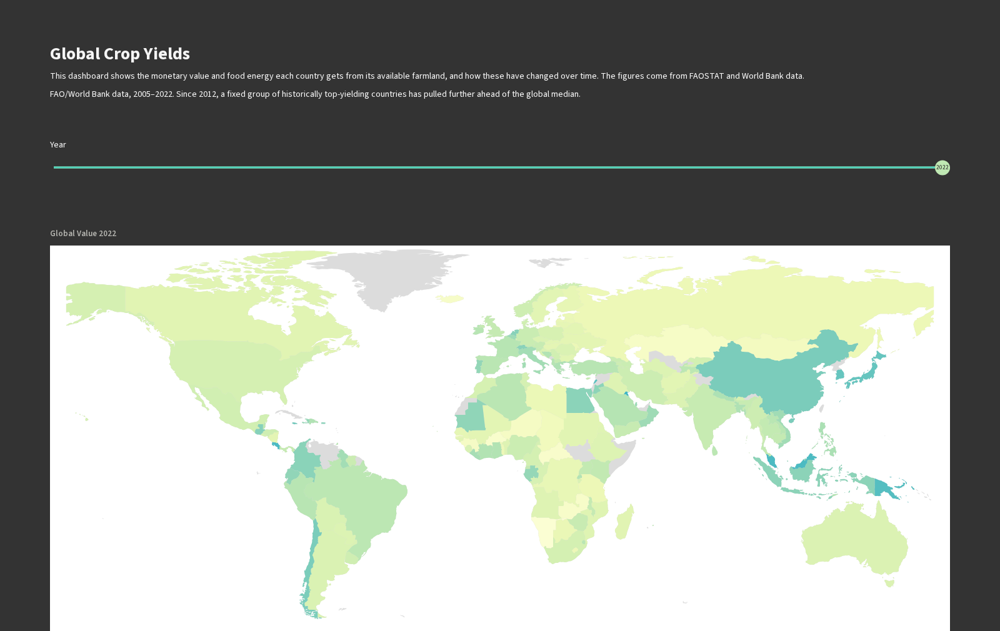

# FAO Crop Yields

A small data pipeline + dashboard that turns FAOSTAT crop production/area
data and World Bank arable-land data into clean CSVs, visualized in a
Streamlit app. Not a package — flat scripts/CSVs in one directory.



Dollar-denominated so crops are comparable across countries, median-based so
outlier crops don't dominate, and every gap-filled or estimated figure is
disclosed on the chart itself, not just in a footnote.

## Setup

```bash
pip install -r requirements.txt
```

## Run the dashboard

```bash
streamlit run dashboard_app.py
```

Reads `FAO_Crop_Yield_TableauReady.csv`, `FAO_Value_Kcal_per_ArableHa.csv`,
`FAO_Crop_Value_TableauReady.csv`, `arable_land_ha.csv`, `area_data.csv`, and
`FAO_ValueGapFill_WB.csv` directly — no other setup needed.

## Regenerating the CSVs

Two ways to regenerate the output CSVs, depending on what raw data you have:

- **`apply_fixes_to_existing_output.py`** — the currently-runnable path. Works
  directly on the already-produced `FAO_Crop_Yield_TableauReady.csv` checked
  into this repo, reapplying all the corrections below. Run with:
  ```bash
  python apply_fixes_to_existing_output.py
  ```
- **`pipeline.py`** — the source-of-truth pipeline, run from the full raw
  FAOSTAT bulk export. Needs
  `Production_Crops_Livestock_E_All_Data_(Normalized).csv` in the project
  root (not included here — it's too large to check in; only a small sample,
  `Production_Crops_Livestock_E_All_Data_(Normalized)_sample.csv`, is
  present). Download the full normalized bulk file for the QCL
  (Crops and livestock products) domain from the FAOSTAT site
  (`https://www.fao.org/faostat/en/#data/QCL`), place it in the project root
  under that exact filename, then run:
  ```bash
  python pipeline.py
  ```

Both scripts share their filtering/correction logic via `fao_filters.py`, so
edits to livestock keywords, aggregate items/areas, or the country-name
mapping only need to happen in one place.

- **`derive_value_kcal.py`** — regenerates `FAO_Value_Kcal_per_ArableHa.csv`
  (country-total value/kcal per arable hectare, behind the Global Value map,
  Top Value, Value & Area, and "$ vs kcal per Arable Hectare" panels) and
  `FAO_Crop_Value_TableauReady.csv` (the per-crop dollar-denominated
  equivalent of `FAO_Crop_Yield_TableauReady.csv`, used only by the panels
  that need a per-crop breakdown — Top Crops by Value, Crop Value vs.
  Cultivated Area). Needs two more large FAOSTAT bulk files not included here
  (see the script's docstring for exact download URLs): the Value of
  Production domain (QV) and Food Balance Sheets (FBS). Its output has real,
  documented coverage gaps (see each panel's own caption) — it's a partial,
  not a complete, accounting of either quantity.
  ```bash
  python derive_value_kcal.py
  ```
- **`derive_eu_value_gap.py`** — regenerates `FAO_EU_Crop_Value_Gap.csv`, which
  `derive_value_kcal.py` merges in automatically if present. Fills part of the
  gap QV leaves for the EU's 27 member states after 2017 (cereals, oilseeds,
  sugar beet, tobacco only — fruit, vegetables, wine, and olives remain a real
  gap) using Eurostat and FAOSTAT's own exchange rates, fetched directly via
  API — no manual download needed. Run this **before** `derive_value_kcal.py`.
  ```bash
  python derive_eu_value_gap.py
  python derive_value_kcal.py
  ```

## Data caveats

The source data has several real pitfalls that both scripts correct for,
summarized here:

- **Yield is derived, not trusted.** FAOSTAT's own "Yield" element has
  changed units across revisions (hg/ha vs kg/ha). Yield is always computed
  as `Production_tons / AreaHarvested_ha` instead.
- **Livestock items are excluded.** FAOSTAT's `Production_Crops_Livestock`
  domain mixes crops with meat/milk/egg/hide/etc. under the same element
  names — these are filtered out via a keyword denylist.
- **FAO's own rollup categories are excluded** (e.g. "Cereals; primary",
  "Fruit Primary") — left in, they double-count their own constituent crops.
- **FAO's own regional/economic rollups are excluded** (e.g. "World",
  "Africa", "European Union (27)") — same double-counting problem at the
  country level.
- **`area_data.csv` is not arable land**, despite its header — it matches
  World Bank "Land area (sq km)". `arable_land_ha.csv` (the real World Bank
  "Arable land (hectares)" indicator) is what's actually used.
- **World Bank and FAO name countries differently** — reconciled via a
  mapping table before joining arable-land data onto production data.
- **Processed/derived products are excluded from the arable-land-productivity
  total.** FAOSTAT mixes primary harvested crops (e.g. "Oil palm fruit") with
  products extracted from them ("Palm oil", "Raw cane or beet sugar", "Cotton
  lint") that never have their own harvested area — left in, they double-count
  the same physical harvest. Confirmed directly: Malaysia's Production per
  Arable Hectare dropped from 162 to 130 t/ha (2022) once its palm-oil
  derivatives were excluded.

The dashboard itself (`dashboard_app.py`, not the CSVs) applies two further
exclusions and one statistic choice, all documented inline in the app's
"Conclusion & Notes" panel:

- **Territories under 1,000 km²** and **country-years reporting fewer than 5
  distinct crops** are excluded — both guard against a handful of
  concentrated entries (e.g. greenhouse produce in a microstate) dominating
  an otherwise-thin sample.
- **Cross-crop yield figures use the median, not the mean** — a country's
  per-crop yields are right-skewed enough that one or two extreme entries can
  dominate a mean (confirmed directly: Iceland's 2022 mean yield was 144
  t/ha, driven almost entirely by two greenhouse crops, vs. a median of 16
  t/ha across all its reported crops).

## Known limitations

- **"Production per Arable Hectare" structurally favors economies whose crop
  output leans on permanent/tree crops** (palm oil, bananas, coffee, cocoa) —
  the World Bank's arable-land denominator excludes land under those crops,
  while the production numerator includes it. The dashboard panel notes
  this; it's a scope mismatch between the two source datasets, not a bug.
- **Data-quality flags are discarded.** FAOSTAT tags each figure as official,
  estimated, imputed, or missing (`Production_Crops_Livestock_E_Flags.csv`);
  that distinction is loaded and schema-checked but never carried through
  into the working data or surfaced in the dashboard. A country's numbers
  may be mostly estimates and this currently reads the same as a country
  reporting entirely official figures.
- **"Production per Arable Hectare" mismatches production year against a
  single, recent arable-land snapshot**, not a year-matched one. Arable land
  changes slowly, so this is a minor effect, but it means e.g. 2005
  production is divided by present-day arable land, not 2005's.

## Project history

This project originally shipped a parallel Tableau workbook alongside the
Streamlit app. It was retired after an audit found its data and formulas
had gone stale relative to the corrected pipeline and were quietly
contradicting the Streamlit app's numbers — Streamlit is now the only
dashboard.
